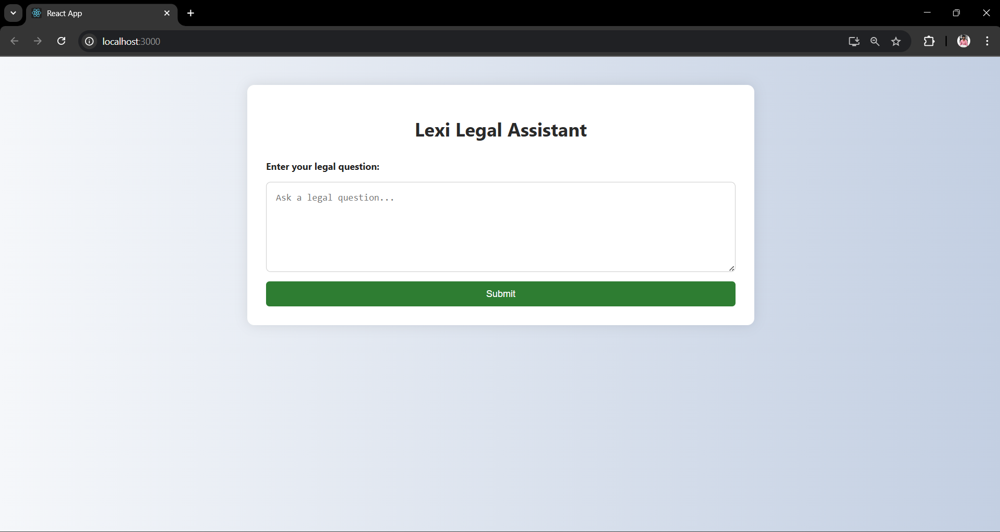
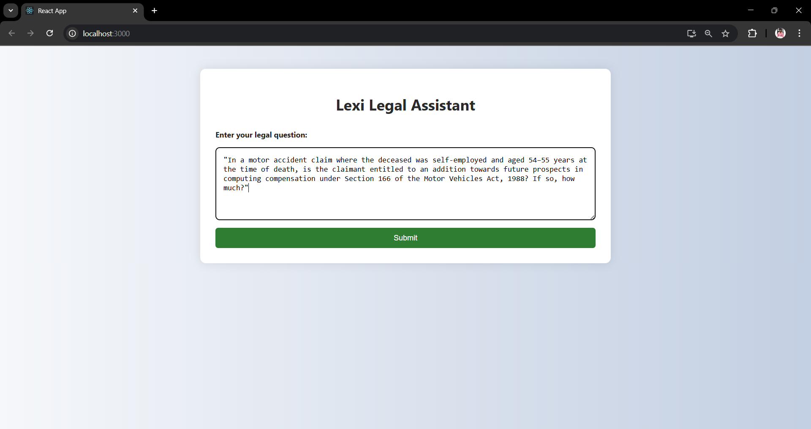
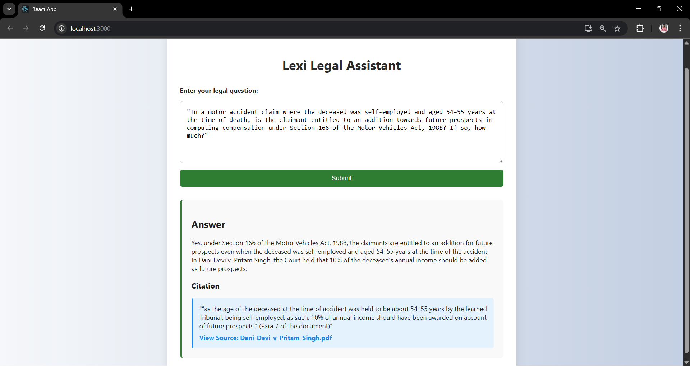

# Lexisg-frontend-intern-test

## Lexisg-frontend-intern-test

This is a minimal, responsive frontend interface simulating Lexi Legal Assistant, built with React.js. It allows users to ask legal questions, view AI-generated answers, and trace citations to their original legal documents.

## 🚀 How to Run the Project

Clone this repository:

https://github.com/asishkumarv/Lexisg-frontend-intern-test.git

Navigate to the project directory:

cd Lexisg-frontend-intern-test

Install dependencies:

npm install

Start the development server:

npm start

Open http://localhost:3000 to view the app.

🖼️Screenshots :
### Main Interface

### Input Panel Display

### Answer Panel Display

### Demo Video

## 🔗 Citation Linking Explanation

Each answer includes a citation box showing the relevant paragraph of legal reference.

The source is linked to the actual PDF document hosted online.

When the user clicks the citation link, it opens the document in a new browser tab using target="_blank" and rel="noopener noreferrer" for safe navigation.

<a
  href={citation.link}
  target="_blank"
  rel="noopener noreferrer"
  className="citation-link"
>
  View Source: {citation.source}
</a>

While real scroll-to-para or highlighting isn't possible without PDF.js or backend integration, this simulates Lexi's traceability by directing users to the source.

## 📁 Tech Stack

React.js (Create React App)

CSS (No Tailwind used)

Responsive and accessible HTML layout

✨ Author

Asish Varanasi

Designed as part of LexisG Intern Frontend Assignment – Legal Assistant Interface with Citations
